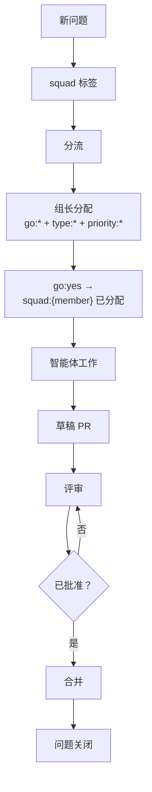

# GitHub 集成

> ⚠️ **实验性** — Squad 是 alpha 软件。API、命令和行为可能在版本间发生变化。

Squad 直接插入你的 GitHub 工作流 —— issues 变成分支，分支变成 PRs，PRs 变成合并的代码。无需上下文切换，无需复制粘贴，无需工单杂耍。只需告诉你的 squad 要构建什么，看着提交滚滚而来。

---

## 试试这个

```
连接到 myorg/myrepo 并展示积压工作
```

```
处理 issue #42
```

```
Ralph，开始 —— 处理积压直到清空
```

---

## 如何工作

生命周期很简单：**连接 → 积压 → 工作 → PR → 合并**。

```
连接仓库  →  展示积压  →  分配 issues  →  智能体分支 + 实现
                                                            ↓
                  合并 PR  ←  审查反馈  ←  智能体打开 PR
```

| 你说 | 发生什么 |
|---------|-------------|
| `"连接到 myorg/myrepo"` | 在 `team.md` 中存储问题源（每个项目一次） |
| `"展示积压"` | 获取并以表格形式显示开放 issues |
| `"处理 #12"` | 智能体创建分支、实现、打开 PR |
| `"处理 #12 和 #15"` | 并行工作 —— 每个 issue 获得自己的分支和 PR |
| `"PR #24 有审查反馈"` | 作者智能体阅读评论并推送修复 |
| `"合并 PR #24"` | 压缩合并、删除分支、关闭链接的问题 |
| `"还剩什么？"` | 刷新积压，显示剩余开放 issues |

**前置条件：** 安装并认证 `gh` CLI（`gh auth login`）。Squad 用它进行所有 GitHub 操作。

---

## 与你的团队一起工作

Squad 为混合团队构建 —— 人类设定方向，AI 智能体执行并回报。组长智能体在他们之间架桥，路由工作并在人类需要行动时浮出水面决策。

### 生命周期中的人类

以下是**混合团队如何划分职责的一个示例**。你的团队决定自己的流程 —— 使用[仪式](../features/ceremonies.md)和[指令](../features/human-team-members.md)来塑造适合的流程。

| 阶段 | 谁行动 | 发生什么 |
|-------|----------|--------------|
| **分流** | 人类（或组长） | 应用 `go:yes` / `go:no` —— 决定什么值得构建 |
| **设计评审** | 人类 + 团队 | 多人工作前自动触发的仪式；人类可以参与或观察 |
| **实现** | AI 智能体 | 分支、构建、测试、打开 PRs —— 无需人工输入 |
| **PR 评审** | 人类 | 审查并批准（或请求更改）；锁定协议防止冲突编辑 |
| **合并** | 人类或 Ralph | 压缩合并、分支清理、问题关闭 |

这是一个起点。通过配置[仪式](../features/ceremonies.md)和捕获[指令](../features/human-team-members.md)来定义你自己的检查点。

有关工作如何路由到人类的详情，参见[人类团队成员](../features/human-team-members.md)。

有关仪式详情，参见[仪式](../features/ceremonies.md)。

有关每个团队成员（AI、人类、@copilot）的结构，参见 [your-team.md](your-team.md) 中的智能体解剖。

---

## 标签分类法

标签不仅仅是标签 —— 它们是 Squad 的**状态机**。五个命名空间驱动工作流自动化、路由和生命周期跟踪。

| 命名空间 | 目的 | 示例值 | 互斥性 |
|-----------|---------|----------------|---------------|
| `go:` | 裁决 | `go:yes`、`go:no`、`go:needs-research` | ✅ 每个 issue 一个 |
| `release:` | 发布目标 | `release:v0.4.0`、`release:backlog` | ✅ 每个 issue 一个 |
| `type:` | 问题类别 | `type:feature`、`type:bug`、`type:spike`、`type:docs`、`type:chore`、`type:epic` | ✅ 每个 issue 一个 |
| `priority:` | 紧急程度 | `priority:p0`、`priority:p1`、`priority:p2` | ✅ 每个 issue 一个 |
| `squad:{member}` | 智能体分配 | `squad:fenster`、`squad:hockney` | ❌ 多个可以（配对工作） |

在 `go:`、`release:`、`type:` 和 `priority:` 中，应用第二个标签**自动移除**第一个。`squad:{member}` 命名空间允许多个标签用于协作工作。

### 标签如何驱动自动化

标签为四个自动化层提供动力：

1. **执行** —— `label-enforcement.yml` 监视更改并移除命名空间内的重复项。
2. **同步** —— 跨命名空间级联：`go:no` → 自动添加 `release:backlog`；`priority:p0` → 确保 `go:yes`。
3. **分流** —— Ralph 使用标签路由工作：`squad:fenster` → Fenster 获取它；没有 `squad:*` + `type:bug` → 基于 `routing.md` 路由。
4. **心跳** —— `squad-heartbeat.yml` 每 30 分钟运行一次，自动分流未分配的问题并升级陈旧的研究。

### 状态机流程



标签在 `init` 或 `upgrade` 期间自动创建。使用以下命令添加自定义标签：

```bash
gh label create "squad:designer" --color "0366d6" --description "工作分配给设计师"
```

---

## Ralph —— 工作监控器

Ralph 是一个内置的 squad 成员，跟踪工作队列、监控 CI 状态并保持团队前进。他总是在花名册上 —— 无需选角。

### 与 Ralph 交谈

| 你说 | 发生什么 |
|---------|-------------|
| `"Ralph，开始"` | 激活自链接工作循环 |
| `"Ralph，状态"` | 单检查周期，报告面板状态 |
| `"Ralph，空闲"` | 停止循环 |
| `"Ralph，范围：仅 issues"` | 仅监控 issues，跳过 PRs/CI |

### Ralph 监控什么

| 信号 | 行动 |
|--------|--------|
| 未分流的问题（无 `squad:{member}` 标签） | 组长分流并分配 |
| 已分配但未开始的问题 | 生成智能体来获取它 |
| 来自 squad 成员的草稿 PRs | 检查智能体是否停滞 |
| PRs 上的审查反馈 | 路由给作者智能体 |
| CI 失败 | 通知智能体修复 |
| 已批准的 PRs | 合并并关闭问题 |

Ralph **在工作剩余时不会自己停止** —— 他持续循环直到面板清空、你说"空闲"或会话结束。每 3-5 轮他发布状态更新并继续。

### Ralph 的三层

| 层 | 何时 | 如何 |
|-------|------|-----|
| **会话中** | 你在键盘前 | `"Ralph，开始"` —— 活跃循环 |
| **本地监视器** | 你离开但机器开着 | `squad watch --interval 10` |
| **云心跳** | 完全无人值守 | `squad-heartbeat.yml` GitHub Actions 事件 |

心跳工作流（`squad-heartbeat.yml`）在 `init` 或 `upgrade` 期间安装。它在问题关闭、PR 合并和手动触发时运行。在 `.github/workflows/squad-heartbeat.yml` 中编辑工作流以自定义触发器。对于没有事件的定期轮询，在本地使用 `squad watch`。

**PAT 要求：** Ralph 需要认证了经典 PAT（范围：`repo` 和 `project`）的 `gh` CLI。默认 `GITHUB_TOKEN` 没有足够的范围。

---

## PRD 模式

有产品规范？交给 Squad，组长将其分解为优先的、依赖跟踪的工作项。

```
阅读 docs/product-spec.md 处的 PRD 并将其分解为工作项
```

组长智能体：
1. 将规范分解为离散工作项（WI-1、WI-2 等）
2. 分配优先级：P0（必须有）、P1（重要）、P2（最好有）
3. 基于领域专长将项目路由给智能体
4. 跟踪依赖 —— 如果 WI-4 依赖 WI-2，则不会启动 WI-4

独立项目并行运行。当需求变化时，给 Squad 更新的 PRD —— 组长与现有项目对比差异并调整后端而不撤销已完成的工作。

---

## 项目面板

Squad 与 GitHub Projects V2 集成以进行可视化工作流跟踪。**标签是真相来源** —— 面板是单向投影，可视化状态机。

| 面板列 | 标签状态 |
|--------------|-------------|
| **积压** | `go:no` 或 `release:backlog` |
| **需要研究** | `go:needs-research` |
| **就绪** | `go:yes`，无 `squad:*` |
| **进行中** | `go:yes` + `squad:{member}` |
| **完成** | 问题已关闭 |

面板同步在标签更改、问题关闭、PR 合并和 30 分钟计划时运行。在面板上拖动问题会触发应用相应标签的 webhook。

**状态：** 基于标签的状态机已完全实现。自动化面板同步工作流正在为 v0.4.0 开发。你现在可以使用 `gh project` 命令 —— 完整自动化即将推出。

---

## 通知

你的 squad 在需要输入、遇到错误或完成工作时 ping 你。Squad 使用基于 MCP 的通知服务器 —— 你自带交付渠道。

有关[平台设置](../features/notifications.md#quick-start-teams-simplest-path)（Teams、Discord、iMessage、webhooks）、[触发器配置](../features/notifications.md#what-triggers-a-notification)和[示例 MCP 配置](../features/notifications.md#sample-mcp-configs)，参见[通知指南](../features/notifications.md)。

---

## 技巧

- 你不需要将 issues 分配给智能体 —— Squad 基于 charter 和 `routing.md` 中定义的域专长路由。
- 如果 `gh` 未认证，Squad 会告诉你。先运行 `gh auth login`。
- 使用 `priority:p0` 快速跟踪关键项目 —— 它自动设置 `go:yes`。
- 将 PRD 模式与 GitHub Issues 结合使用以从工作项自动创建 issues。
- Ralph 的会话中循环是会话范围的 —— 状态在会话间重置。使用 `squad watch` 或心跳进行持久监控。

---

## 示例提示

```
连接到 bradygaster/squad 并展示积压
```

将 Squad 链接到 GitHub 仓库并显示所有开放 issues。

```
处理所有标记为 "bug" 的 issues
```

并行处理多个 bug issues —— 每个获得自己的分支和 PR。

```
将 issue #42 标记为批准用于 v0.4.0
```

应用 `go:yes` 和 `release:v0.4.0` 标签，移除任何冲突标签。

```
Ralph，开始 —— 开始监控并处理积压直到清空
```

激活 Ralph 的自链接循环以持续分流、分配和处理工作。

```
阅读 docs/product-spec.md 处的 PRD 并将其分解为工作项
```

摄取产品规范并创建优先的、依赖跟踪的后端。

```
PR #24 有审查反馈
```

作者智能体阅读审查评论并推送修复到现有分支。

```
列出所有批准用于下一个发布的 p0 功能
```

查询带有 `priority:p0 + type:feature + go:yes + release:{当前里程碑}` 的 issues。

```
squad watch --interval 5
```

启动持久本地轮询 —— 每 5 分钟检查 GitHub 以获取新工作并自动分流。
