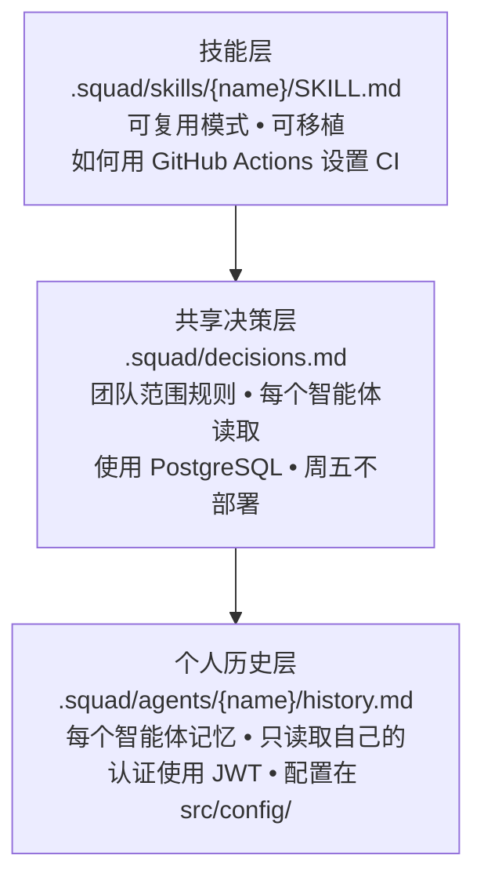

# 记忆与知识

> ⚠️ **实验性** — Squad 是 alpha 软件。API、命令和行为可能在版本间发生变化。

Squad 记住一切 —— 编码约定、架构决策、部署模式、你的个人偏好。记忆随着每次会话增长，在三层中复合，所以智能体不再犯同样的错误，开始预测你的需求。

---

## 试试这个

```
始终在 TypeScript 中使用单引号
```

```
团队对测试策略做了什么决策？
```

```
展示这个团队学到了什么技能
```

---

## 如何工作

记忆存在于三层中，每层服务于不同目的：



### 记忆如何复合

| 阶段 | 智能体知道什么 |
|-------|-----------------|
| 🌱 首次会话 | 项目描述、技术栈、你的名字 |
| 🌿 几次会话后 | 约定、组件模式、API 设计、测试策略 |
| 🌳 成熟项目 | 完整架构、技术债务图、回归模式、性能约定 |

首次会话总是能力最低的。给团队几次会话来建立上下文 —— 他们会停止询问已经回答过的问题。

---

## 个人记忆：history.md

每个智能体有自己的历史文件在 `.squad/agents/{name}/history.md`。每次会话后，智能体追加他们学到的内容 —— 架构决策、约定、文件路径、用户偏好。

**只有该智能体读取自己的历史。** 这意味着每个团队成员建立关于其领域的专业知识。Kane 从内到外学习认证系统。Dallas 掌握组件库。Lambert 记住测试基础设施。

### 渐进式摘要

当智能体的 `history.md` 超过 ~12KB 时，旧条目归档到摘要部分。近期条目保持详细；旧条目浓缩。这保持文件在有用上下文预算内而不丢失积累的知识。

---

## 共享决策：decisions.md

团队范围的决策存在于 `.squad/decisions.md` 中。**每个智能体在工作前阅读这个。** 这是团队的共享大脑。

决策通过三种方式捕获：

1. **来自智能体工作** —— 智能体写入 `.squad/decisions/inbox/{agent-name}-{slug}.md`
2. **来自你的指令** —— 当你说"始终…"或"绝不…"时（见下文）
3. **来自 Scribe 合并** —— Scribe 智能体定期将收件箱文件整合到规范的 `decisions.md` 中，去重重叠条目

### 决策归档

随着项目增长，`decisions.md` 积累数百个块。陈旧的冲刺工件和一次性规划片段消耗上下文而不增加价值。当这种情况发生时，旧决策归档到 `.squad/decisions-archive.md` —— 保留供参考但不再加载到智能体上下文中。

活跃决策（持续政策、用户偏好、当前架构）保留在 `decisions.md` 中。智能体总是阅读精简的、当前的共享大脑。

### 记忆架构

```
.squad/
├── decisions.md                          # 共享 —— 所有智能体读取
├── decisions/inbox/                      # 并行写入的投递箱
│   ├── kane-api-versioning.md
│   └── dallas-component-structure.md
├── decisions-archive.md                  # 归档的旧决策
├── agents/
│   ├── kane/
│   │   └── history.md                    # Kane 的个人记忆
│   ├── dallas/
│   │   └── history.md                    # Dallas 的个人记忆
│   └── lambert/
│       └── history.md                    # Lambert 的个人记忆
└── skills/
    ├── squad-conventions/SKILL.md        # 入门技能
    └── ci-github-actions/SKILL.md        # earned 技能
```
