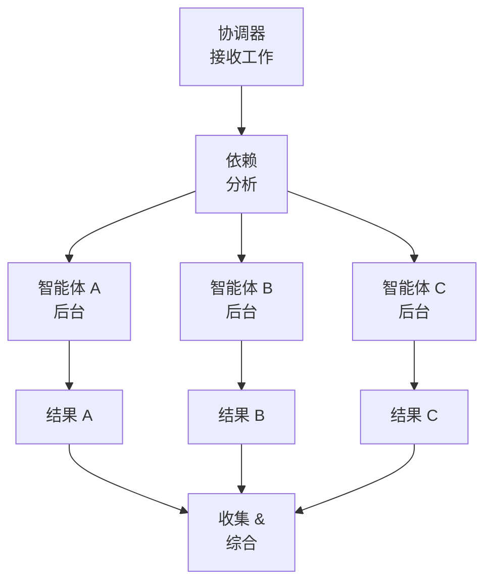
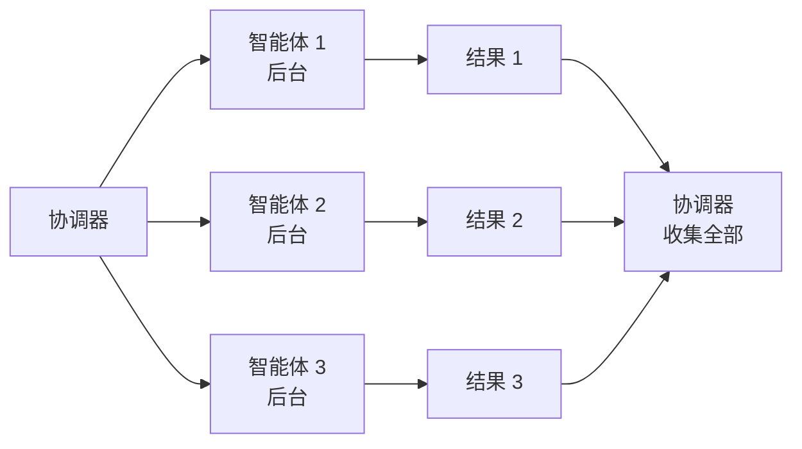
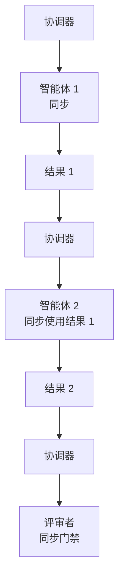

# 并行工作与模型

> ⚠️ **实验性** — Squad 是 alpha 软件。API、命令和行为可能在版本间发生变化。

Squad 默认启动独立的并行工作 —— 多个智能体同时工作，无需等待。它还根据每个智能体在做什么选择正确的 AI 模型，所以你在重要地方获得质量，在其他地方获得速度。

---

## 试试这个

```
让三个智能体并行处理这个：UI 模型、API 规范、数据库模式
```

```
代码用 Sonnet，其他用 Haiku
```

```
同时处理 issues #12、#15 和 #18
```

---

## 并行执行如何工作

当协调器收到多部分任务时，它遵循展开模式：



1. **依赖分析** —— 检查任务是否有数据依赖（A 需要 B 的输出）。
2. **展开** —— 使用后台模式并行启动所有独立智能体。
3. **等待** —— 协调器轮询智能体状态直到全部完成。
4. **收集** —— 聚合结果，检查错误，路由到下一步。

### 示例

> "实现用户认证：API 端点、前端表单、测试和文档"

协调器**并行生成 4 个智能体**：
- 后端 → API 端点
- 前端 → 登录/注册表单
- 测试人员 → 集成测试
- 开发者关系 → 认证文档

所有同时工作。除非有代码依赖，否则没有智能体等待。

---

## 后台 vs 同步

| 模式 | 何时使用 | 行为 |
|------|-----------|----------|
| **后台** | 独立工作，无数据依赖 | 智能体并行运行，协调器轮询完成 |
| **同步** | 一个智能体需要另一个的输出 | 智能体顺序运行，协调器等待 |
| **同步** | 评审者门禁（组长必须先批准） | 智能体运行，协调器等待[评审](your-team.md#reviewer-protocol)决策 |

### 后台（展开）



智能体在协调器收集和综合之前看不到彼此的输出。

### 同步（依赖和门禁）



每一步阻塞直到前一步完成。

### 急切执行

Squad 的默认是**急切并行** —— 启动一切可以运行的，让协调器处理同步。

- **更快吞吐** —— 无人工排序
- **更好利用** —— 多个智能体饱和可用计算
- **有弹性** —— 如果一个智能体停滞，其他继续工作

权衡：增加 API 成本。如果成本是问题：

```
顺序工作以节省成本
```

### 死锁避免

当智能体有循环依赖（A 需要 B，B 需要 A）时，协调器检测循环并要求你选择一个解决方案：先运行 A、先运行 B，或重新设计。

### 并发限制

- **默认：** 5 个智能体并行
- **可调整：** `"最多同时运行 2 个智能体"` → 协调器相应地批处理工作

---

## 模型选择

Squad 根据每个智能体在做什么将他们路由到正确的 AI 模型 —— 不是一刀切默认。

### 选择层

第一个匹配获胜：

| 层 | 如何工作 |
|-------|-------------|
| **1. 用户覆盖** | 你说 `"使用 opus"` 或 `"节省成本"` —— 完成，会话范围 |
| **2. Charter 偏好** | 智能体的 charter 有 `## 模型` 部分 |
| **3. 任务感知自动** | 协调器检查智能体实际在做什么（见下表） |
| **4. 默认** | `claude-haiku-4.5` —— 有疑义时成本优先 |

### 任务感知默认

| 任务输出 | 模型 | 等级 |
|-------------|-------|------|
| 编写代码（实现、重构、测试、bug 修复） | `claude-sonnet-4.5` | 标准 |
| 编写提示或智能体设计 | `claude-sonnet-4.5` | 标准 |
| 非代码工作（文档、规划、分流、变更日志） | `claude-haiku-4.5` | 快速 |
| 需要图像分析的视觉/设计工作 | `claude-opus-4.5` | 高级 |

### 角色到模型映射

| 角色 | 默认模型 | 原因 |
|------|--------------|-----|
| 核心开发 / 后端 / 前端 | `claude-sonnet-4.5` | 编写代码 —— 质量优先 |
| 测试人员 / QA | `claude-sonnet-4.5` | 编写测试代码 |
| 组长 / 架构师 | 自动（按任务） | 混合：代码审查 vs 规划 |
| 提示工程师 | 自动（按任务） | 提示设计就像代码 |
| 开发者关系 / 编写者 | `claude-haiku-4.5` | 文档 —— 不是代码 |
| 书记员 / 记录器 | `claude-haiku-4.5` | 机械文件操作 |
| Git / 发布 | `claude-haiku-4.5` | 变更日志、标签、版本提升 |
| 设计师 / 视觉 | `claude-opus-4.5` | 需要视觉能力 |

### 模型目录（16 个模型）

Squad 支持三个等级的模型：

- **高级：** claude-opus-4.6、claude-opus-4.6-fast、claude-opus-4.5
- **标准：** claude-sonnet-4.5、gpt-5.2-codex、claude-sonnet-4、gpt-5.2、gpt-5.1-codex、gpt-5.1、gpt-5、gemini-3-pro-preview
- **快速/便宜：** claude-haiku-4.5、gpt-5.1-codex-mini、gpt-4.1、gpt-5-mini、gpt-5.1-codex-mini

### 回退链

如果模型不可用（计划限制、速率限制、弃用），Squad 静默重试链中的下一个。永远不会**向上**回退 —— 快速任务不会落到高级模型。

```
高级：  claude-opus-4.6 → claude-opus-4.6-fast → claude-opus-4.5 → claude-sonnet-4.5
标准： claude-sonnet-4.5 → gpt-5.2-codex → claude-sonnet-4 → gpt-5.2
快速：     claude-haiku-4.5 → gpt-5.1-codex-mini → gpt-4.1 → gpt-5-mini
```

---

## Copilot 编码智能体 (@copilot)

将 GitHub Copilot 编码智能体作为自治团队成员添加到你的 Squad。它获取问题、创建分支、打开 PR —— 所有这些都无需聊天会话。

### 前置条件

1. 仓库上启用了 **Copilot 编码智能体**（Settings → Copilot → Coding agent）
2. `.github/` 中存在 **`copilot-setup-steps.yml`**
3. 仓库上启用了 **GitHub Actions**

### 快速开始

```bash
# 添加带自动分配的 @copilot
squad copilot --auto-assign

# 创建经典 PAT（repo 范围）并作为 secret 添加
gh secret set COPILOT_ASSIGN_TOKEN

# 提交并推送
git add .github/ .squad/ && git commit -m "feat: 添加 copilot 到 squad" && git push

# 测试 —— 用 squad:copilot 标记任何 issue
```

或在对话中：`"添加带自动分配功能的 copilot 到 squad"`

### @copilot 有何不同

| | AI 智能体 | 人类成员 | @copilot |
|---|----------|-------------|----------|
| 徽章 | ✅ Active | 👤 人类 | 🤖 编码智能体 |
| Charter | ✅ | ❌ | ❌（使用 `copilot-instructions.md`） |
| 在会话中工作 | ✅ | ❌ | ❌（通过 issue 分配异步） |
| 创建 PR | 通过会话 | Squad 外部 | 自治 |

### 能力档案

`team.md` 中的档案控制 @copilot 处理什么：

| 等级 | 含义 | 示例 |
|------|---------|----------|
| 🟢 **适合** | 自动路由 | Bug 修复、测试覆盖、代码检查修复、依赖更新、小功能、文档 |
| 🟡 **需要评审** | 路由但标记评审 | 带规范的中等功能、带测试的重构、API 添加 |
| 🔴 **不适合** | 路由给 squad 成员 | 架构、多系统设计、安全关键、模糊需求 |

### 自动分配流程

当 `squad:copilot` 标签添加到 issue 时：
1. 工作流发布路由评论
2. 工作流将 `copilot-swe-agent[bot]` 分配给 issue
3. 编码智能体创建 `copilot/*` 分支并打开草稿 PR

自动分配需要存储为 `COPILOT_ASSIGN_TOKEN` 的经典 PAT（细粒度 PAT 对此端点返回 403）。

---

## Git Worktree

Squad 支持 git worktree，为同时在多个分支上工作的团队提供两种策略。

### Worktree-本地（独立状态）

每个 worktree 获得自己的 `.squad/` 目录。一个 worktree 中的智能体看不到另一个的状态。

```
project/
├── .squad/                    # 主 worktree 团队

project-feature-a/
├── .squad/                    # 功能 A 团队（独立）

project-feature-b/
├── .squad/                    # 功能 B 团队（独立）
```

**最适合：** 不同团队的多功能、实验分支、每个 worktree 不同组成。

### 主检出（共享状态）

所有 worktree 通过符号链接共享主检出的 `.squad/`。

```
project/
├── .squad/                    # 所有 worktree 共享

project-feature-a/
├── .squad -> ../project/.squad/  # 符号链接

project-feature-b/
├── .squad -> ../project/.squad/  # 符号链接
```

**最适合：** 多个分支上的相同团队、协调并行开发、多分支的独立开发者。

### 哪个策略？

| 场景 | 策略 |
|----------|----------|
| 并行功能，相同团队 | 主检出 |
| 实验分支，隔离团队 | Worktree-本地 |
| 热修复 + 功能分支 | 主检出 |
| 同一仓库中的多个团队 | Worktree-本地 |

设置是一个命令：`"使用主 worktree 的团队"`（创建符号链接）或 `"在此 worktree 中初始化 Squad"`（创建独立的 `.squad/`）。

Squad 对仅限追加的日志文件使用 `merge=union` 以避免跨 worktree 的冲突。

---

## 技巧

- 急切并行是默认。只有当成本是真正问题时才切换到顺序。
- 从保守的 @copilot 能力档案开始，随着你看到它处理良好的内容而扩展。
- 将 `squad:copilot` 标签与[问题驱动开发](../scenarios/issue-driven-dev.md)一起使用以进行完全自治处理。
- 回退链是静默的 —— 除非你问 `"Kane 用了什么模型？"`，否则你不会注意到模型切换。
- 对于 worktree，主检出通常是正确的选择，除非你真正需要隔离的团队。

---

## 示例提示

```
构建新的仪表板功能 —— 所有人并行工作
```

协调器同时生成所有相关智能体（前端、后端、测试人员、开发者关系）。

```
同时处理 issues #12、#15 和 #18
```

并行生成 3 个智能体，每个 issue 一个。

```
先实现 API，然后编写测试 —— 顺序执行
```

强制同步模式：后端完成，然后测试人员开始。

```
最多同时运行 2 个智能体以节省成本
```

设置并发限制。协调器分组批处理工作。

```
为此架构工作使用 opus
```

一次性覆盖到高级模型以完成高风险任务。

```
始终使用 haiku 以节省成本
```

会话范围偏好最便宜模型等级。

```
添加带自动分配功能的 copilot 到 squad
```

将 @copilot 添加到花名册并配置自动 issue 分配。

```
使用主 worktree 的 Squad 团队
```

创建符号链接，以便此 worktree 共享主检出的 `.squad/` 状态。
