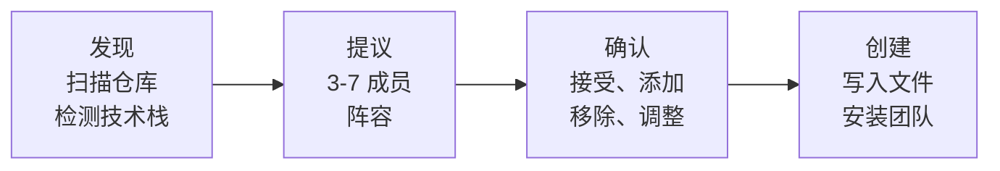

# 你的团队

> ⚠️ **实验性** — Squad 是 alpha 软件。API、命令和行为可能在版本间发生变化。

Squad 为你构建一支存在于你仓库中的 AI 专家团队。告诉它你在做什么，它就会提议一个阵容 —— 后端开发、测试人员、编写者、组长 —— 每个人都有自己独特的个性、专长和记忆。你的团队每次会话都会变得更聪明。

---

## 试试这个

```
为 React + Node.js API 和 PostgreSQL 设置一个团队
```

```
Fenster，修复登录验证 bug
```

```
向团队添加安全专家
```

---

## 如何工作

当你在仓库中首次运行 Squad 时，它会经历四步初始化流程：



1. **发现** —— Squad 扫描你的仓库：语言、文件结构、测试框架、依赖项、现有工作流。
2. **提议** —— 它根据发现的内容建议一个 3-7 名成员的阵容。
3. **确认** —— 你审查并定制：按原样接受、添加角色、移除角色、重命名成员。
4. **创建** —— Squad 写入 `.squad/` 目录，创建 charter，并设置协调器。

### 创建了什么

```
.squad/
├── team.md                         # 团队花名册
├── routing.md                      # 工作路由规则
├── decisions.md                    # 团队记忆（指令）
├── decisions/inbox/                # 待处理决策写入
├── agents/
│   ├── {member}/
│   │   ├── charter.md              # 角色、技能、声音
│   │   └── context.md              # 智能体特定笔记
│   └── ...
├── skills/                         # 可复用知识文件
├── log/                            # 执行日志
├── orchestration-log/              # 协调器状态
└── casting/                        # 宇宙分配
```

### 默认团队组成

| 角色 | 何时包含 |
|------|--------------|
| **组长** | 始终 —— 分流、评审、解除阻塞 |
| **核心开发** | 始终 —— 主要实现 |
| **测试人员** | 如果存在测试或检测到测试依赖 |
| **开发者关系** | 如果存在 README 或 `docs/` |
| **前端** | 如果检测到 React/Vue/Svelte/Angular |
| **后端** | 如果检测到 API 路由、数据库代码或服务器框架 |
| **书记员** | 始终 —— 静默决策记录器 |

---

## 人类团队成员

不是每个团队成员都需要是 AI。为需要人类的决策添加真人 —— 设计审批、安全审查、产品批准。

```
添加 Sarah 作为设计审查员
```

Sarah 出现在花名册上，带有 👤 人类徽章。

| | AI 智能体 | 人类成员 |
|---|----------|-------------|
| 徽章 | 角色特定表情 | 👤 人类 |
| Charter | ✅ | ❌ |
| 历史 | ✅ | ❌ |
| 作为子智能体生成 | ✅ | ❌ |
| 可以评审工作 | ✅ | ✅ |

当工作路由到人类时，Squad **暂停** 并告诉你有人需要行动。你在 Squad 外部协调任务，然后回报发生了什么。陈旧提醒保持事情进展。

不确定某人应该是花名册成员还是普通 GitHub 协作者？有关决策框架，请参阅[何时添加人类成员](../features/human-team-members.md#when-to-add-a-human-member)。

---

## 工作路由

协调器使用三种策略自动路由工作。第一个匹配获胜：

| 策略 | 如何工作 | 示例 |
|----------|-------------|---------|
| **命名** | 你说谁来做 | `"Fenster，修复登录 bug"` |
| **领域** | `.squad/routing.md` 中的模式匹配 | `src/api/**` → 后端 |
| **基于技能** | `.squad/skills/` 中的能力检查 | 认证专长 → 后端或组长 |

**路由优先级：** 命名 > 领域 > 基于技能。如果没有匹配，组长分流。

### 示例路由表

```markdown
| 模式 | 负责人 | 原因 |
|---------|-------|--------|
| `src/api/**` | 后端 | API 实现 |
| `src/components/**/*.tsx` | 前端 | React 组件 |
| `*.test.ts` | 测试人员 | 测试文件 |
| `docs/**` | 开发者关系 | 文档 |
```

带有 `squad:{member}` 标签的 GitHub issues 直接路由 —— `squad:fenster` 直接给 Fenster，无需分流。

### 多智能体工作

某些任务需要多个智能体：

```
Fenster，实现 API。Hockney，编写测试。
```

协调器并行生成两者。他们独立工作并通过共享的 `.squad/` 状态协调。详情参见[并行工作与模型](parallel-work.md)。

---

## 评审者协议

当评审者（组长、测试人员）拒绝工作时，原始智能体被**锁定**—— 不允许自我修订。这防止无尽的修复重试循环。

```
智能体 A 编写代码 → 组长拒绝 → 智能体 A 被锁定
  → 协调器重新分配给智能体 B 或升级给你
```

| 结果 | 发生什么 |
|---------|-------------|
| **批准** | PR 合并，问题关闭，智能体解锁 |
| **请求更改** | 作者被锁定，工作重新分配或升级 |

### 锁定详情

- **任务特定** —— 被锁定在该 PR/issue，不是所有工作
- **会话持久** —— 在重启后幸存（存储在 `.squad/orchestration-log/`）
- **可清除** —— `"解锁 Fenster 处理 issue #42"`

### 评审者权限

| 评审者 | 范围 |
|----------|-------|
| **组长** | 代码质量、架构、安全 —— 所有提交 |
| **测试人员** | 正确性、测试覆盖 —— 与测试相关的更改 |
| **你** | 最终仲裁者 —— 可以覆盖任何决策 |

### 死锁处理

如果所有有能力的智能体都被锁定，协调器升级给你并提供选项：手动修复、带指导解锁，或作为 won't-fix 关闭。

---

## 仪式

在关键时刻触发的结构化团队会议 —— 自动或按需。

| 仪式 | 自动触发时 | 发生什么 |
|----------|-------------------|-------------|
| **设计评审** | 2 个以上智能体修改共享系统的多人任务 | 组长主持；智能体对接口、风险、契约发表意见 |
| **回顾** | 构建失败、测试失败、评审者拒绝 | 组长进行根本原因分析；决策写入 `decisions.md` |

随时手动运行：

```
在我们开始认证重建之前运行设计评审
```

你还可以创建自定义仪式、禁用自动触发，或为单个任务跳过仪式。配置位于 `.squad/ceremonies.md`。

---

## 响应模式

Squad 为每个请求自动选择正确的努力程度：

| 模式 | 时间 | 发生什么 | 触发条件 |
|------|------|-------------|-------------|
| **直接** | ~2-3s | 协调器从记忆中回答，不生成智能体 | 状态检查、事实问题 |
| **轻量** | ~8-12s | 一个智能体，最小提示 —— 跳过 charter/历史/决策 | 小修复、拼写错误、快速跟进 |
| **标准** | ~25-35s | 完整智能体生成，带 charter、历史和决策 | 正常工作请求 |
| **完整** | ~40-60s | 多智能体并行生成，可能触发设计评审 | 复杂多领域任务 |

**专业提示：** `"Team, ..."` 提示触发完整模式。命名智能体提示（`"Kane, ..."`）触发标准。快速问题自动获得直接。

---

## 初始化后定制

| 你说什么 | 发生什么 |
|--------------|-------------|
| `"添加数据库专家"` | 协调器选角新成员，创建 charter，更新路由 |
| `"从团队中移除 McManus"` | 将智能体目录存档到 `.squad/agents/.archived/`，更新 team.md |
| `"将测试人员更改为专注于集成测试"` | 更新测试人员的 charter 和专长 |
| `"将所有 CSS 文件路由到前端"` | 添加规则到 `.squad/routing.md` |
| `"从现在开始，McManus 在合并前评审所有文档"` | 创建路由规则 + [指令](../features/memory.md) |

在现有的 Squad 仓库上运行 `init` 会自动提供升级模式。

---

## 规划你的团队

在运行 `squad init` 之前，思考这些决策。Squad 会扫描你的仓库并提议一个团队 —— 准备好答案会让设置更快。

- **你的项目做什么？** 准备好语言、技术栈和用途的 1-2 句话描述 —— Squad 用它来选择角色
- **你需要什么角色？** [默认组成](#default-team-composition) 涵盖常见情况，或让 Squad 根据你的仓库提议自定义角色
- **多少智能体？** 典型团队是 3-7 个智能体。Scribe（记忆）始终包含
- **人类会加入团队吗？** [人类成员](#human-team-members) 可以作为评审者或领域专家与 AI 智能体一起服务
- **@copilot 会参与吗？** GitHub Copilot 编码智能体可以自主获取问题 —— 参见[智能体解剖](#agent-anatomy)
- **你将如何跟踪工作？** 带 `squad:{member}` 标签的 GitHub Issues，或通过命名提示的对话式任务分配
- **你想要审查门禁吗？** [评审者](#reviewer-protocol) 可以在工作继续前批准或拒绝
- **什么仪式重要？** [设计评审和回顾](#ceremonies) 可以自动触发或按需运行
- **什么模型偏好？** 默认是自动选择，或为每个智能体指定首选模型 —— 参见[并行工作与模型](parallel-work.md)
- **多少 squad，它们住在哪里？** 每个仓库一个 squad 是默认 —— 你的 `.squad/` 目录与你的代码一起存在。对于多仓库项目，你可以每个仓库运行一个 squad（每个都有自己的团队）或使用个人 squad 或链接的团队仓库在仓库间共享单个 squad。从一个仓库的一个 squad 开始，按需扩展。

---

## 智能体解剖

智能体是 `.squad/agents/{name}/` 处的目录。内容取决于成员类型。

有关人类与 AI 智能体的区别，参见上文[人类团队成员](#human-team-members)。

| | @copilot (🤖) |
|---|---|
| 目录 | 无 |
| `charter.md` | ❌ 使用 `copilot-instructions.md` |
| `history.md` | ❌ |
| 可生成 | ❌ 通过 issue 分配工作 |

**AI 智能体** 有 `charter.md`（身份、专长、声音 —— 在生成时编译到系统提示中）和可选的 `history.md`（仅限追加的跨会话学习）。

**@copilot** (🤖) 出现在花名册上，通过 GitHub issue 分配工作。它读取 `.github/copilot-instructions.md` 而不是 charter。

**退休智能体** 移动到 `.squad/agents/_alumni/{name}/` —— charter 作为只读存档保留，不可生成。

---

## 跨智能体上下文

智能体不直接共享记忆。上下文通过显式共享文件流动：

- **`team.md`** —— 谁在团队中，他们做什么
- **`routing.md`** —— 协调器在每次请求时读取的工作分配规则
- **`decisions.md`** —— 规范团队记忆：指令、模式、学习
- **`.squad/decisions/inbox/`** —— 智能体在这里放置决策文件；Scribe 将它们合并到 `decisions.md`

每个智能体的 `history.md` 是私人的 —— 只有该智能体在生成时阅读。有关知识流的完整信息，参见[记忆与知识](../features/memory.md)。

---

## 雇佣智能体

向你的团队添加新 AI 智能体：

- [ ] 创建 `.squad/agents/{name}/` 目录
- [ ] 编写 `charter.md` —— 从 `.squad/templates/charter.md` 开始
- [ ] 用状态 `✅ Active` 添加到 `team.md` 花名册
- [ ] 用工作类型分配添加到 `routing.md`
- [ ] （可选）为持久记忆创建 `history.md`
- [ ] （可选）通过选角系统分配名称

添加**人类成员**，跳过目录 —— 只需将他们添加到 `team.md`。徽章和路由详情参见[人类团队成员](#human-team-members)。

---

## 技巧

- **提交 `.squad/`** 到版本控制 —— 任何克隆仓库的人都会获得团队及其所有积累的知识。
- 对人类成员使用审批门禁：设计评审、合规、最终签字。
- 设计评审防止智能体构建冲突的实现 —— 让它们对多人智能体任务运行。
- 回顾产生[决策](../features/memory.md)以改进未来工作，而不仅是诊断当前失败。
- 你是人类成员的传递者。Squad 不能直接给他们发消息 —— 它告诉你，你协调。

---

## 示例提示

```
为此项目启动新的 Squad 团队
```

触发初始化模式 —— Squad 分析仓库并提议团队。

```
Fenster，实现新的搜索 API。Hockney，为其编写集成测试。
```

命名路由到两个智能体。两者都[并行](parallel-work.md)生成。

```
添加 Jordan 作为安全审查员
```

添加具有特定审查职责的人类团队成员。

```
将所有数据库迁移路由到后端
```

添加领域路由规则到 `.squad/routing.md`。

```
组长，评审 PR #15
```

触发审查 —— 组长评估并批准（合并）或拒绝（锁定作者）。

```
解锁 Fenster 处理 issue #42 —— 我给了更好的指导
```

清除锁定，以便 Fenster 可以用你的额外上下文修订 PR。

```
对那些测试失败运行回顾
```

启动回顾仪式来分析失败并捕获学习。

```
谁处理认证工作？
```

协调器检查路由和技能，报告负责的智能体。
